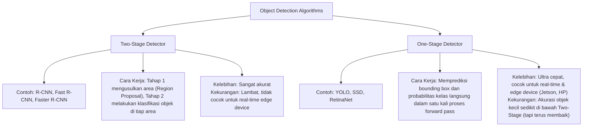
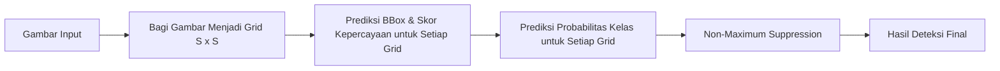
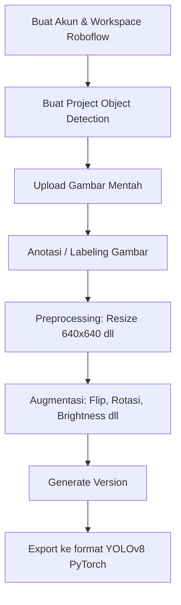

# Week 5: Introduction to YOLO & Roboflow Dataset Preparation

Selamat datang di **Week 5**! Pada minggu ini, kita akan melompat ke dunia **Object Detection** (Deteksi Objek) secara real-time. Jika minggu lalu kita belajar dasar manipulasi piksel menggunakan OpenCV, minggu ini kita akan berkenalan dengan salah satu arsitektur deteksi objek paling populer dan tercepat di dunia AI saat ini: **YOLO (You Only Look Once)**, khususnya versi **YOLOv8** yang dikembangkan oleh Ultralytics.

Selain itu, kita juga akan mempelajari bagaimana cara menyiapkan dataset kustom berkualitas menggunakan platform cloud **Roboflow**, yang mencakup proses pelabelan (labeling), pembersihan data (preprocessing), hingga rekayasa variasi data (augmentation).

---

## 1. Konsep Dasar Object Detection

Sebelum masuk ke YOLO, penting bagi kita untuk memahami perbedaan beberapa tugas utama dalam Computer Vision:

*   **Image Classification**: Menentukan *apa* objek utama dalam suatu gambar (Output: Label Kelas, contoh: *"Ikan"*).
*   **Object Localization**: Menentukan *di mana* letak satu objek dalam gambar dengan menggambarkan kotak pembatas (Output: Bounding Box + Label Kelas).
*   **Object Detection**: Menentukan lokasi dan mengidentifikasi *banyak objek sekaligus* dalam satu gambar (Output: Multi Bounding Box + Label Kelas untuk tiap kotak).
*   **Instance Segmentation**: Mengidentifikasi setiap objek dan menentukan batas piksel spesifik dari objek tersebut (bukan hanya kotak pembatas).

### One-Stage vs. Two-Stage Detector

Metode Object Detection umumnya dibagi menjadi dua kategori utama berdasarkan arsitekturnya:



---

## 2. Mengenal YOLO (You Only Look Once)

YOLO pertama kali diperkenalkan oleh **Joseph Redmon dkk.** pada tahun 2015. Ide utamanya sangat revolusioner: alih-alih memindai gambar berulang kali seperti metode Two-Stage, YOLO membagi gambar menjadi kisi-kisi (grid) dan memproses seluruh gambar dalam satu kali evaluasi jaringan saraf tiruan (neural network).

### Bagaimana YOLO Bekerja?



1.  **Grid Division**: Gambar input dibagi menjadi grid berukuran $S \times S$. Jika titik tengah (center) dari suatu objek jatuh ke dalam suatu sel grid, sel grid tersebut bertanggung jawab untuk mendeteksi objek tersebut.
2.  **Bounding Box & Confidence**: Setiap sel grid memprediksi $B$ bounding box beserta skor kepercayaannya (confidence score). Koordinat bounding box terdiri dari $(x, y, w, h)$ di mana $(x,y)$ adalah titik pusat kotak relatif terhadap grid, dan $(w,h)$ adalah lebar dan tinggi relatif terhadap seluruh gambar.
3.  **Class Probability**: Setiap sel grid juga memprediksi probabilitas kelas objek.
4.  **Non-Maximum Suppression (NMS)**: Karena satu objek bisa dideteksi oleh beberapa grid/box dengan tingkat overlap tinggi, YOLO menggunakan algoritma NMS untuk membuang kotak-kotak dengan tingkat kepercayaan rendah atau yang tumpang tindih secara berlebihan, menyisakan hanya satu kotak terbaik dengan nilai IoU (*Intersection over Union*) optimal.

### Evolusi YOLO secara Singkat

*   **YOLOv1 - YOLOv3 (2015-2018)**: Dibuat menggunakan framework custom bernama Darknet oleh Joseph Redmon. YOLOv3 memperkenalkan deteksi multi-skala yang sangat meningkatkan akurasi objek kecil.
*   **YOLOv4 & YOLOv5 (2020)**: Joseph Redmon mundur karena masalah etika AI. YOLOv4 dirilis oleh Alexey Bochkovskiy dengan optimasi arsitektur. Beberapa bulan kemudian, Glenn Jocher (Ultralytics) merilis **YOLOv5** berbasis PyTorch yang sangat populer karena kemudahan integrasi dan deployment-nya.
*   **YOLOv7 & YOLOv8 (2022-2023)**: Dirilis oleh Ultralytics, **YOLOv8** memperkenalkan arsitektur **Anchor-free** (tidak lagi bergantung pada preset anchor box seperti versi sebelumnya), kepala deteksi terpisah (decoupled head), dan mendukung berbagai tugas (Classification, Object Detection, Instance Segmentation, Pose Estimation, & Tracking) dalam satu library tunggal (`ultralytics`).

---

## 3. Varian Model YOLOv8

YOLOv8 menyediakan 5 varian ukuran model yang dapat dipilih sesuai dengan spesifikasi perangkat keras (hardware) yang digunakan. Semakin besar ukuran model, semakin tinggi akurasinya, namun kecepatannya akan berkurang.

| Varian Model | Parameter (M) | Ukuran File (MB) | Deskripsi & Kegunaan | Kecepatan & Akurasi |
| :---: | :---: | :---: | :--- | :---: |
| **YOLOv8n** (Nano) | 3.2 | ~6.3 | Sangat cocok untuk dijalankan di Edge Devices (seperti **Nvidia Jetson Orin/Nano**, Raspberry Pi, smartphone) atau komputer tanpa GPU. | Tercepat, Akurasi Terendah |
| **YOLOv8s** (Small) | 11.2 | ~22.3 | Keseimbangan yang baik antara kecepatan dan akurasi untuk project skala kecil. | Cepat, Akurasi Cukup |
| **YOLOv8m** (Medium) | 25.9 | ~51.2 | Pilihan terbaik untuk pelatihan dataset kustom umum jika memiliki GPU kelas menengah. | Sedang, Akurasi Bagus |
| **YOLOv8l** (Large) | 43.7 | ~86.2 | Digunakan untuk deteksi objek kompleks dengan variasi bentuk yang tinggi. | Lambat, Akurasi Tinggi |
| **YOLOv8x** (Extra Large) | 68.2 | ~134.4 | Memberikan akurasi tertinggi (State-of-the-Art) tetapi membutuhkan sumber daya komputasi GPU yang besar. | Terlambat, Akurasi Terbaik |

---

## 4. Persiapan Dataset dengan Roboflow

Dalam pengembangan model deteksi objek kustom, langkah paling krusial adalah menyiapkan dataset. **Roboflow** adalah platform berbasis cloud yang sangat mempermudah alur kerja ini.



### Langkah demi Langkah Penggunaan Roboflow:

1.  **Membuat Project**:
    *   Daftar/masuk ke [Roboflow](https://roboflow.com/).
    *   Klik **Create New Project**.
    *   Pilih jenis project: **Object Detection** (Bounding Box).
    *   Beri nama project dan tentukan kelas objek yang ingin dideteksi (misalnya dalam *Amarine Vision*: `fish`, `coral`, `trash`, `jellyfish`).

2.  **Upload & Annotate (Labeling)**:
    *   Unggah gambar-gambar mentah Anda.
    *   Gunakan tool labeling bawaan Roboflow untuk menggambar kotak pembatas di sekitar objek target dan menetapkan label kelasnya.
    *   *Tip:* Anda bisa menggunakan fitur **Smart Click / Auto-Label** berbantuan AI untuk mempercepat proses pembuatan bounding box.

3.  **Data Preprocessing (Pembersihan Data)**:
    *   **Resize**: YOLOv8 bekerja optimal pada ukuran gambar input standar $640 \times 640$ piksel. Roboflow secara otomatis melakukan resize agar ukuran semua gambar seragam sebelum masuk ke tahap training.
    *   **Auto-Orient**: Memastikan orientasi gambar benar (menghilangkan metadata rotasi kamera yang salah).

4.  **Data Augmentation (Augmentasi Data)**:
    Kenapa kita butuh augmentasi? Pada lingkungan nyata—terutama di bawah air (marine vision)—kondisi cahaya, kekeruhan air, sudut pengambilan gambar, dan jarak objek sangat bervariasi. Augmentasi membantu memperbanyak dataset secara sintetis sehingga model tidak mengalami *overfitting* (hanya pintar mendeteksi gambar latihan asli saja).
    *   **Flip** (Horizontal & Vertical): Mensimulasikan objek yang berenang atau berada pada posisi terbalik.
    *   **Rotation** (misal: $-15^\circ$ hingga $+15^\circ$): Mensimulasikan kemiringan kamera bawah air akibat arus laut.
    *   **Brightness** (misal: $-25\%$ hingga $+25\%$): Mensimulasikan intensitas cahaya matahari di bawah air yang berubah-ubah tergantung kedalaman.
    *   **Blur & Noise**: Mensimulasikan kekeruhan air laut atau kualitas sensor kamera yang rendah.

5.  **Generate Version & Export**:
    *   Klik **Generate New Version**. Roboflow akan menggabungkan gambar asli, preprocessing, dan versi augmentasi menjadi satu kesatuan dataset terstruktur.
    *   Pilih **Export Dataset**.
    *   Pilih format ekspor: **YOLOv8**.
    *   Pilih opsi **show download code** untuk mendapatkan potongan kode Python (berisi API Key unik Anda) agar dataset bisa langsung diunduh ke notebook proyek kita.

---

## 5. Struktur Dataset YOLOv8

Ketika Anda mengekspor dataset YOLOv8, struktur folder yang dihasilkan akan terlihat seperti ini:

```text
dataset-name/
├── data.yaml                 # Berkas konfigurasi utama YOLO
├── train/
│   ├── images/               # Gambar untuk training
│   └── labels/               # File teks anotasi koordinat (.txt) untuk training
├── valid/
│   ├── images/               # Gambar untuk validasi
│   └── labels/               # File teks anotasi koordinat (.txt) untuk validasi
└── test/
    ├── images/               # Gambar untuk pengujian independen
    └── labels/               # File teks anotasi koordinat (.txt) untuk pengujian
```

### Memahami Berkas `data.yaml`
Berkas yaml ini memberi tahu YOLO di mana letak folder gambar training/validasi, jumlah kelas objek, dan nama-nama kelas objek tersebut. Contoh isi berkas `data.yaml`:
```yaml
train: ../train/images
val: ../valid/images
test: ../test/images

nc: 3
names: ['fish', 'coral', 'jellyfish']
```

### Memahami Berkas Anotasi YOLO (`.txt`)
Setiap gambar akan memiliki berkas teks pendamping dengan nama yang sama persis di dalam folder `labels/`. Setiap baris pada file teks mewakili satu bounding box objek dengan format:
```text
<class_id> <x_center> <y_center> <width> <height>
```
*   `class_id`: Indeks numerik dari kelas (0 untuk kelas pertama, 1 untuk kelas kedua, dst.).
*   `x_center`, `y_center`, `width`, `height`: Semua koordinat telah dinormalisasi antara `0.0` hingga `1.0` (dihitung terhadap lebar dan tinggi gambar). Hal ini membuat koordinat bersifat independen terhadap resolusi gambar asli.

---

## 6. Basic Inference Code dengan YOLOv8

Sebelum kita mulai melakukan training di minggu berikutnya, mari kita coba menjalankan model YOLOv8 menggunakan bobot (weights) pre-trained yang sudah dilatih pada dataset COCO (kumpulan dataset umum berisi 80 kelas objek sehari-hari).

### Instalasi Library
Untuk menginstal YOLOv8, aktifkan environment Conda Anda terlebih dahulu, kemudian jalankan:
```bash
conda activate TL-Amarine-Vision
pip install ultralytics
```

### Python Script (Deteksi Objek Sederhana)
```python
from ultralytics import YOLO
import cv2 as cv

# 1. Memuat model YOLOv8 versi Nano yang sudah dilatih (pre-trained)
model = YOLO('yolov8n.pt') 

# 2. Menjalankan deteksi pada gambar target (bisa berupa path file lokal atau URL internet)
results = model('images/sample.jpg')

# 3. Menampilkan hasil deteksi di layar
results[0].show()

# 4. Menyimpan hasil gambar yang sudah digambari bounding box ke folder runs/
results[0].save(filename='runs/hasil_deteksi.jpg')

# 5. Mendapatkan koordinat bounding box dan kelas hasil deteksi secara mentah
for box in results[0].boxes:
    print(f"Kelas ID: {int(box.cls[0])}")
    print(f"Confidence Score: {float(box.conf[0]):.2f}")
    print(f"Koordinat Box (x1, y1, x2, y2): {box.xyxy[0].tolist()}")
```

### a. Deteksi Objek pada File Video
YOLOv8 dapat memproses file video secara langsung. Karena model pre-trained `yolov8n.pt` dilatih menggunakan dataset COCO yang mendeteksi 80 objek umum (seperti orang, mobil, dll.), kita akan menggunakan contoh video lokal berisi orang yang sudah tersedia di folder proyek kita (`../week4/images/video.mp4`).

**Metode 1: Proses Langsung & Otomatis Simpan**
```python
# Memproses video dan menyimpan hasilnya ke folder runs/detect/predict/
results = model('../week4/images/video.mp4', save=True)
```

**Metode 2: Menggunakan Loop OpenCV (Live Preview)**
```python
import cv2 as cv
from ultralytics import YOLO

model = YOLO('yolov8n.pt')
# Menggunakan berkas video lokal yang berisi objek umum (seperti orang)
cap = cv.VideoCapture('../week4/images/video.mp4')

while cap.isOpened():
    ret, frame = cap.read()
    if not ret:
        break
    
    # Jalankan prediksi pada frame saat ini
    results = model(frame)
    
    # Ambil frame yang sudah digambari bounding box
    annotated_frame = results[0].plot()
    
    # Tampilkan frame hasil deteksi
    cv.imshow('YOLOv8 Video Detection', annotated_frame)
    
    # Tekan 'q' untuk keluar dari video
    if cv.waitKey(1) & 0xFF == ord('q'):
        break

cap.release()
cv.destroyAllWindows()
```

### b. Deteksi Objek Real-Time Menggunakan Webcam
Dengan mengganti input file video dengan indeks kamera (`0` untuk webcam bawaan), kita bisa melakukan deteksi objek secara real-time dari kamera laptop. Kita menggunakan argumen `stream=True` pada YOLOv8 agar pemrosesan video lebih hemat memori karena frame diproses dalam mode generator.

```python
import cv2 as cv
from ultralytics import YOLO

# Muat model
model = YOLO('yolov8n.pt')

# Buka akses webcam
cap = cv.VideoCapture(0)

print("Kamera aktif. Tekan tombol 'q' pada jendela video untuk keluar.")

while True:
    ret, frame = cap.read()
    if not ret:
        print("Gagal mengambil gambar dari webcam.")
        break
    
    # Inferensi frame webcam (stream=True untuk optimalisasi memori video streaming)
    results = model(frame, stream=True)
    
    for r in results:
        # Terapkan visualisasi anotasi ke frame
        annotated_frame = r.plot()
        # Tampilkan frame
        cv.imshow('YOLOv8 Real-Time Webcam', annotated_frame)
    
    # Keluar jika menekan tombol 'q'
    if cv.waitKey(1) & 0xFF == ord('q'):
        break

# Bersihkan resources
cap.release()
cv.destroyAllWindows()
```

## 7. Pengujian Video dengan Model Kustom Hasil Training (Testing Model)
Setelah Anda melakukan pelatihan (*training*) model pada dataset kustom Anda sendiri (yang akan dibahas secara mendalam di Week 6), YOLOv8 akan menyimpan bobot (weights) terbaik hasil latihan ke berkas `best.pt` di folder `runs/detect/train/weights/best.pt`.

Untuk menguji performa model kustom tersebut pada berkas video asli Anda (sebagai data testing), kita cukup memuat jalur file `best.pt` tersebut dan memproses videonya frame-demi-frame menggunakan loop OpenCV. Caranya sangat mirip dengan deteksi pre-trained model:

```python
import cv2 as cv
from ultralytics import YOLO

# 1. Muat model menggunakan bobot (weights) kustom hasil training Anda
# (Ganti path sesuai lokasi file best.pt hasil training Anda nanti)
model_kustom = YOLO('runs/detect/train/weights/best.pt')

# 2. Buka berkas video asli yang ingin Anda jadikan bahan pengujian (testing)
video_test_path = 'images/video_asli_testing.mp4'
cap = cv.VideoCapture(video_test_path)

print("Menjalankan deteksi video dengan model kustom Anda...")

while cap.isOpened():
    ret, frame = cap.read()
    if not ret:
        break
    
    # Jalankan inferensi menggunakan model kustom Anda
    results = model_kustom(frame)
    
    # Gambar bounding box kelas kustom Anda pada frame
    annotated_frame = results[0].plot()
    
    # Tampilkan frame hasil deteksi kustom
    cv.imshow('Custom Trained Model Detection', annotated_frame)
    
    # Tekan 'q' pada keyboard untuk keluar lebih cepat
    if cv.waitKey(1) & 0xFF == ord('q'):
        break

# Lepaskan resources
cap.release()
cv.destroyAllWindows()
print("Pengujian video dengan model kustom selesai!")
```

---

## 🚀 Tugas Praktik Mandiri Week 5

Untuk memperkuat pemahaman Anda pada materi minggu ini, ikuti instruksi tugas praktis berikut:

1.  **Buka file notebook pendukung**: Jalankan notebook [yolov8_roboflow.ipynb](file:///c:/Users/EZZRA/Desktop/Transfer-Learning-Amarine-Vision/week5/yolov8_roboflow.ipynb) yang berada di folder ini. Ikuti setiap sel kode untuk mencoba memanggil model YOLOv8 pertama Anda dan melakukan deteksi objek.
2.  **Pembuatan Dataset di Roboflow**:
    *   Buat akun di [Roboflow](https://roboflow.com/).
    *   Unggah minimal **30 gambar** bertema bawah air/kelautan (Anda bisa mencarinya di Google Images atau menggunakan dataset gambar bawah air publik yang kecil).
    *   Lakukan pelabelan (labeling) bounding box pada objek-objek tersebut secara mandiri.
    *   Terapkan langkah Preprocessing: **Resize (640x640)**.
    *   Terapkan minimal **3 metode Augmentasi** (misalnya: *Horizontal Flip*, *Rotation +/- 15 deg*, *Brightness adjustment*).
    *   Generate dataset tersebut dan ekspor menggunakan pilihan **YOLOv8 PyTorch**.
    *   Salin kode ekspor (termasuk token API Roboflow) dan simpan untuk persiapan training di Week 6.

Selamat bereksperimen dengan YOLOv8 dan Roboflow! Jika ada kesulitan dalam proses anotasi maupun ekspor dataset, silakan diskusikan di forum tim.
